## Screenshots
[Back to home](../)

## Public Pages
Normal User | Admin/Logged-in User
### Homepage
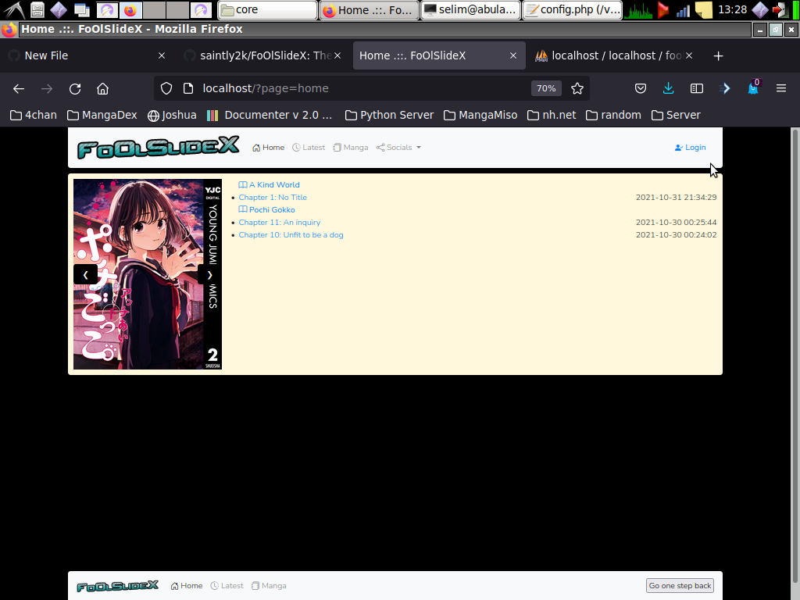 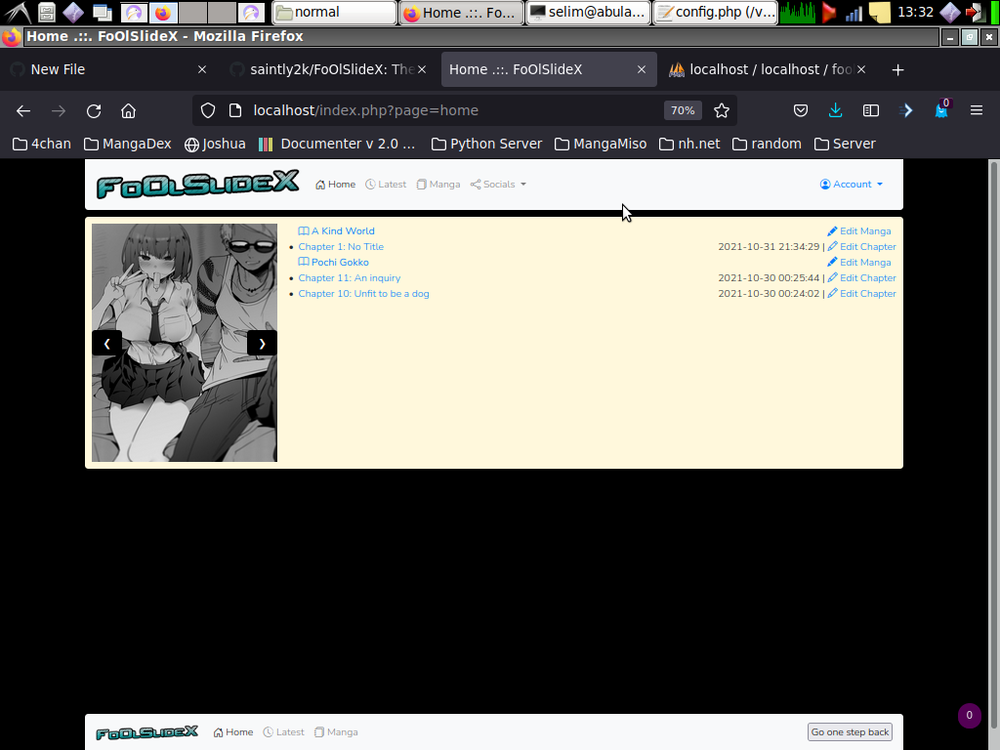
### Latest Releases
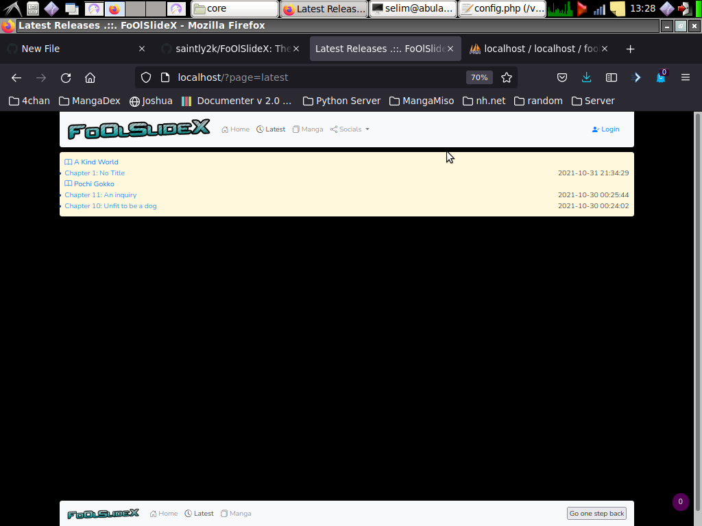 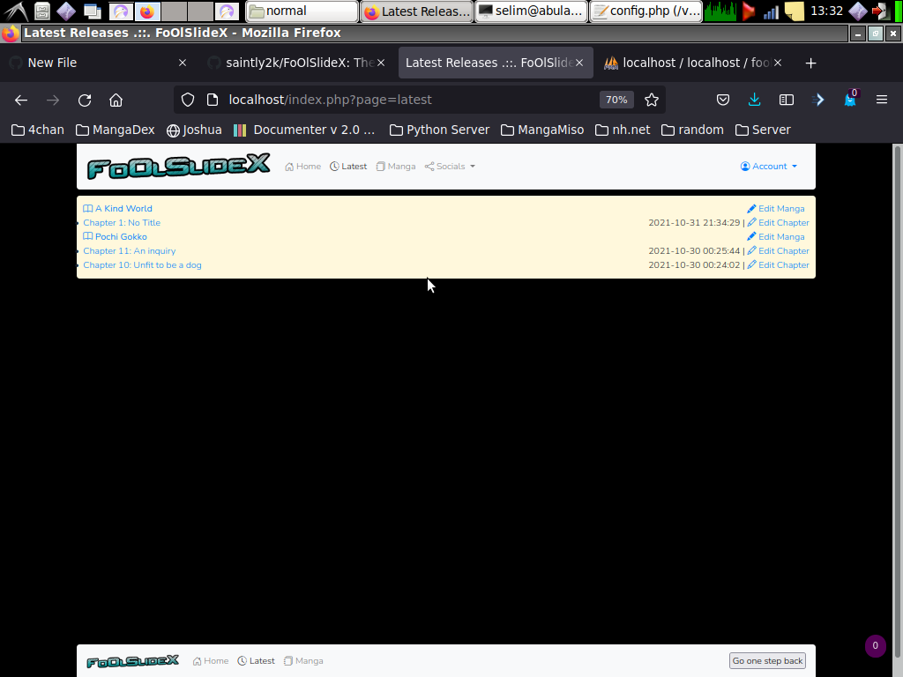
### Mangas
 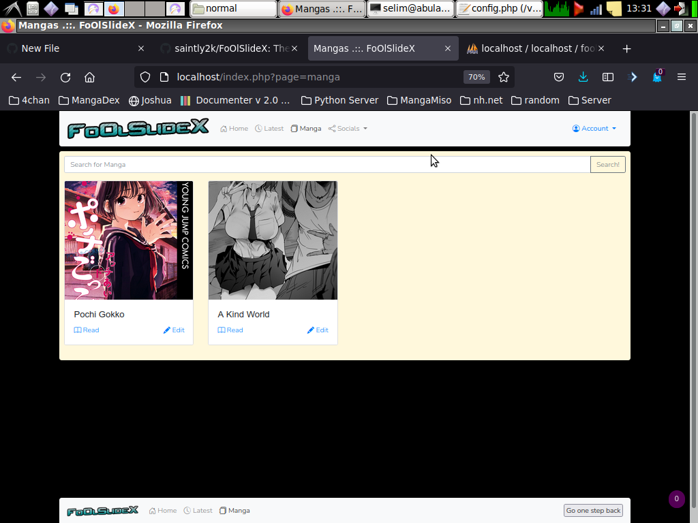
### About Page
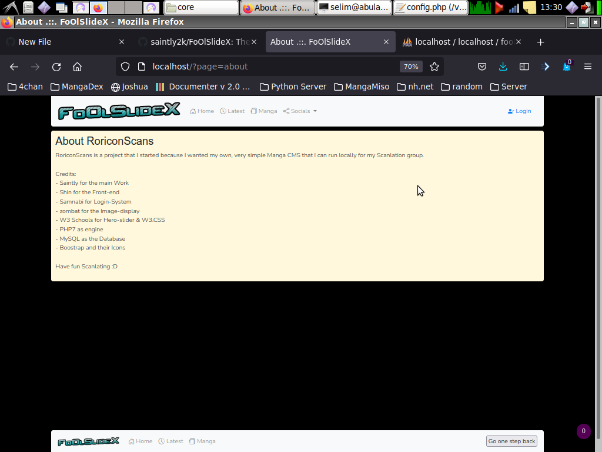 
### View Manga
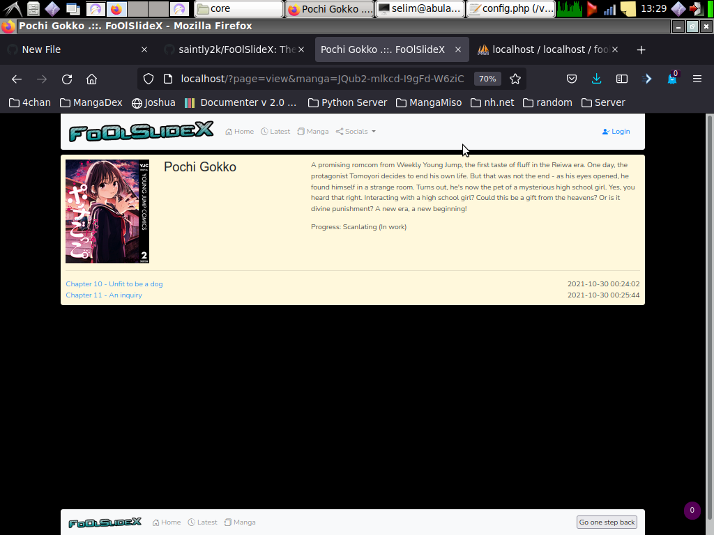 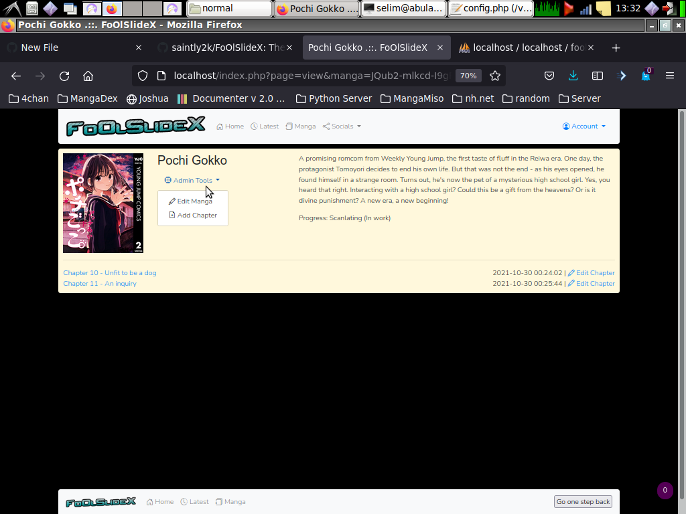
### View Chapter
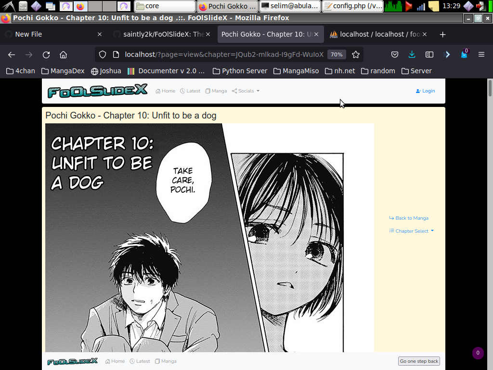 
### Chapter Selection
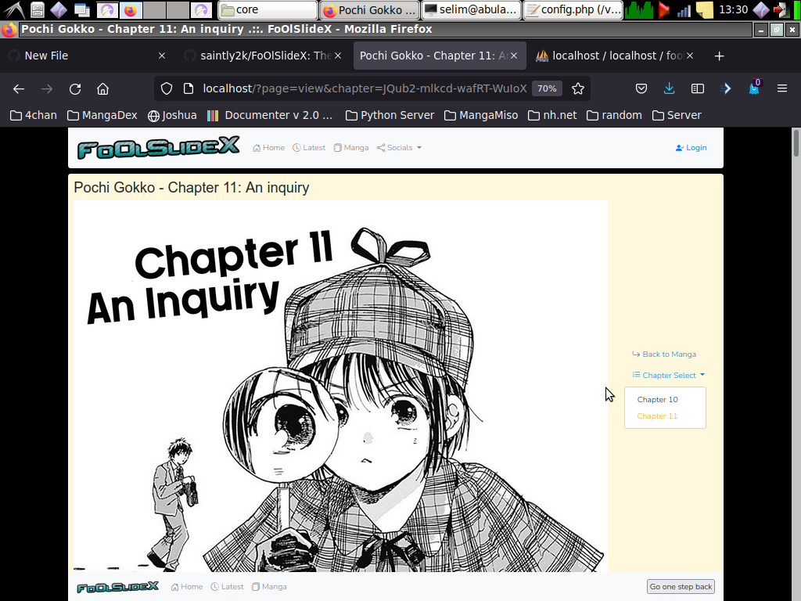 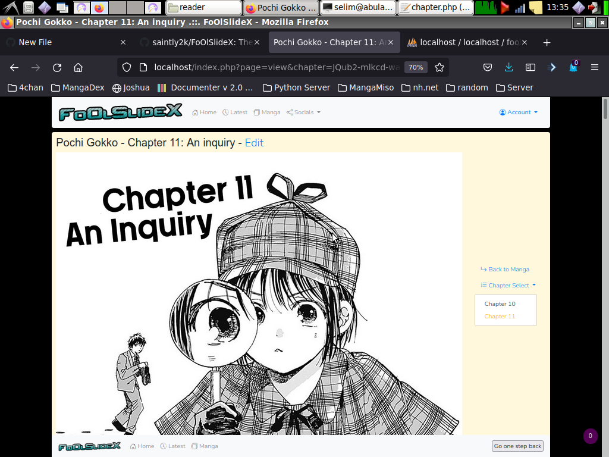
[Back to home](../)

## Admin/User-only Pages
[Back to home](../)
### Adding a Manga

### Editing a Manga

### Adding a Chapter

### Editing a Chapter

### Admin Panel

(Images Soon™)

[Back to home](../)
